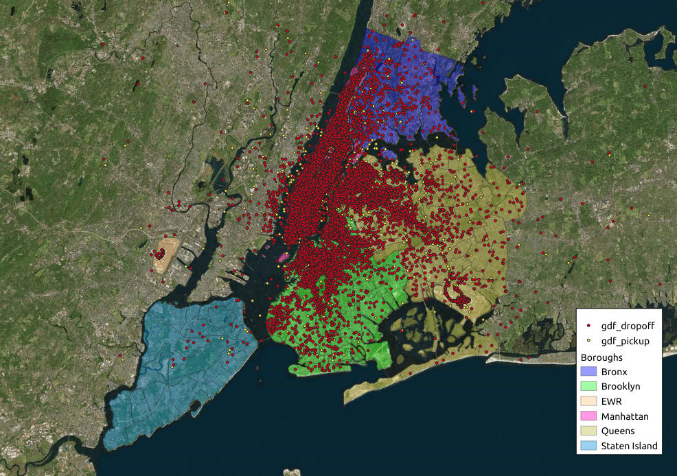

New York City Taxi Fare Prediction
---

This project is an attempt at predicting taxi fares in the Kaggle competition [New York City Taxi Fare Prediction](https://www.kaggle.com/c/new-york-city-taxi-fare-prediction).

The project consists of four notebooks:

- data_preparation.ipynb
- data_exploration.ipynb
- hyperparameter_tuning.ipynb
- modelling.ipynb

In addition to these notebooks, [QGIS](https://www.qgis.org) has been used to create some of the vizualisations.

### [File descriptions](https://www.kaggle.com/c/new-york-city-taxi-fare-prediction/data)

- train.csv - Input features and target fare_amount values for the training set (about 55M rows).
- test.csv - Input features for the test set (about 10K rows). Your goal is to predict fare_amount for each row.
- sample_submission.csv - a sample submission file in the correct format (columns key and fare_amount). This file 'predicts' fare_amount to be $11.35 for all rows, which is the mean fare_amount from the training set.

### Data fields

#### ID

key - Unique string identifying each row in both the training and test sets. Comprised of pickup_datetime plus a unique integer, but this doesn't matter, it should just be used as a unique ID field. Required in your submission CSV. Not necessarily needed in the training set, but could be useful to simulate a 'submission file' while doing cross-validation within the training set.

#### Features

    - pickup_datetime - timestamp value indicating when the taxi ride started.
    - pickup_longitude - float for longitude coordinate of where the taxi ride started.
    - pickup_latitude - float for latitude coordinate of where the taxi ride started.
    - dropoff_longitude - float for longitude coordinate of where the taxi ride ended.
    - dropoff_latitude - float for latitude coordinate of where the taxi ride ended.
    - passenger_count - integer indicating the number of passengers in the taxi ride.

#### Target

fare_amount - float dollar amount of the cost of the taxi ride. This value is only in the training set; this is what you are predicting in the test set and it is required in your submission CSV.